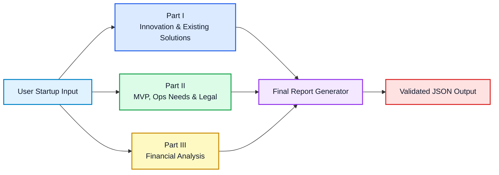
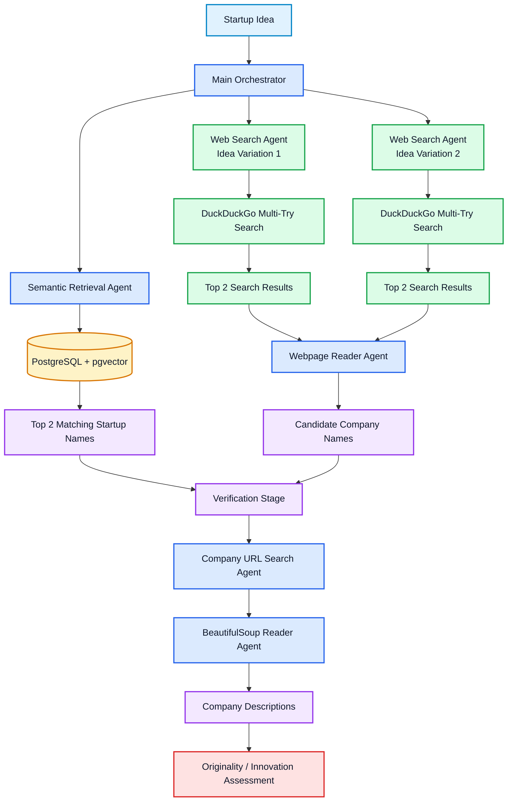
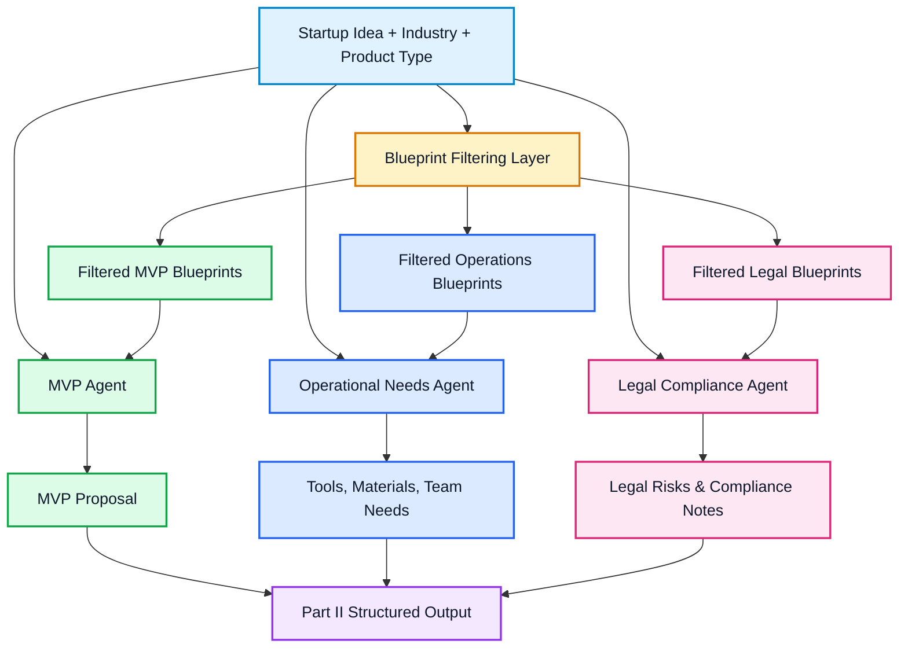
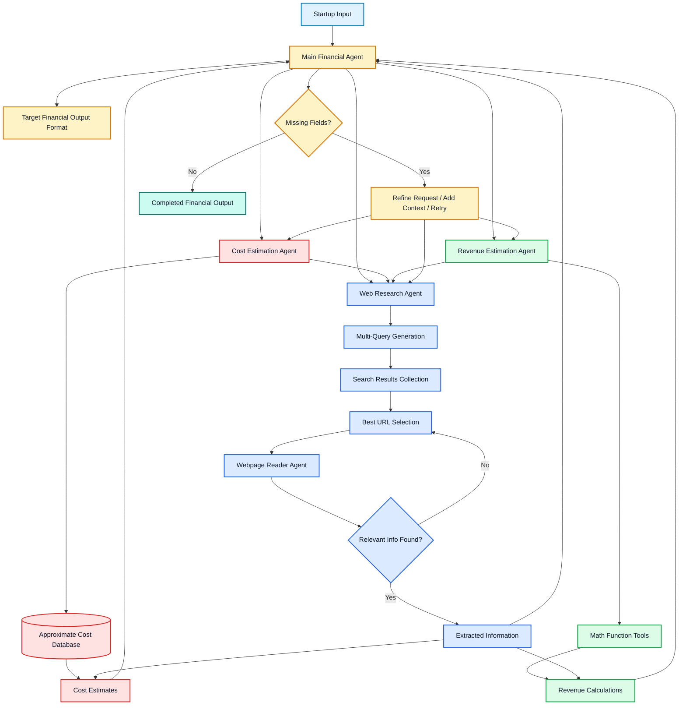

# 🚀 Startup Idea Validation Multi-Agent System

<p align="center">
  <strong>Academic multi-agent AI project for startup idea evaluation</strong><br>
  Agentic AI · MCP / A2A-style workflows · Startup research · MVP planning · Financial projection
</p>

---

## 📌 Overview

This project is an **academic work** built to demonstrate practical control over:

- 🧠 **Agentic AI systems**
- 🤝 **Multi-agent collaboration**
- 🔌 **MCP / A2A-style communication workflows**
- 🔎 **Automated startup research and evaluation**

The system helps a user who is thinking about launching a startup gain a clearer first view of the idea by evaluating it across three major dimensions:

| Dimension | Goal |
|---|---|
| 🟦 **Innovation and existing solutions** | Check whether similar companies or products already exist. |
| 🟩 **Operational feasibility and MVP design** | Estimate what a first version of the product could look like and what it may require. |
| 🟨 **Financial viability** | Estimate costs, revenues, assumptions, and basic financial feasibility. |

> [!IMPORTANT]
> This project is **not designed to be a perfectly accurate business decision-maker**.  
> It is a **guided approximation tool** whose goal is to accelerate research, organize uncertainty, and give the user a first serious overview of a startup idea.

---

## 🧭 Project at a Glance

| Item | Description |
|---|---|
| 🎯 **Main purpose** | Help evaluate startup ideas through a structured multi-agent pipeline. |
| 🧱 **Architecture** | Three major analysis parts followed by a final report-generation stage. |
| 🤖 **Agent style** | Specialized agents coordinated through orchestration, tool wrappers, MCP, and A2A-style communication. |
| 🧠 **Main model context** | Built around small/local LLM constraints, with decomposition into specialized agents. |
| 📦 **Main output** | A structured JSON report designed to be consumed by a web application. |
| ⏱️ **Typical runtime** | Around **8 minutes**, sometimes up to **10 minutes** when retries are needed. |
| 🧪 **Project type** | Academic demonstration and practical prototype. |

---

## 📚 Table of Contents

- [Overview](#-overview)
- [Global Pipeline](#-global-pipeline)
- [Part I — Innovation and Existing Solutions](#-part-i--innovation-and-existing-solutions)
- [Part II — MVP, Operational Needs, and Legal Compliance](#-part-ii--mvp-operational-needs-and-legal-compliance)
- [Part III — Financial Analysis and Projection](#-part-iii--financial-analysis-and-projection)
- [Final Aggregation and Report Generation](#-final-aggregation-and-report-generation)
- [Challenges and Limitations](#-challenges-and-limitations)
- [Project Architecture and Execution](#-project-architecture-and-execution)
- [Results and Evaluation](#-results-and-evaluation)
- [Script and Folder Reference](#-script-and-folder-reference)

---

# 🧩 Global Pipeline

The system is organized into **four main stages**:

| Stage | Name | Main Question |
|---|---|---|
| 🟦 **Part I** | Innovation and existing solutions analysis | Are there already similar companies or solutions? |
| 🟩 **Part II** | MVP, operational needs, and legal compliance | What would be needed to build and launch the idea? |
| 🟨 **Part III** | Financial analysis and projection | What could the main costs and revenue assumptions look like? |
| 🟪 **Part IV** | Final JSON report generation and validation | How can all outputs be merged into one clean web-ready report? |

## 🗺️ Global Architecture



---

# 🟦 Part I — Innovation and Existing Solutions

The first part evaluates whether the startup idea is innovative and whether similar solutions already exist.

Its role is to:

- identify companies that may already address the same problem
- understand what those companies actually do
- decide whether the proposed idea is original, partially differentiated, or already represented by existing solutions

## 🎯 What This Stage Produces

| Output | Description |
|---|---|
| 🔍 Similar company names | Candidate companies found through the local database and web search. |
| 🌐 Web-based company descriptions | Short descriptions extracted from relevant webpages. |
| 🧠 Originality judgment | A final assessment of whether the idea is innovative or already covered. |
| ⚠️ Uncertainty awareness | Notes when results may be weak, incomplete, or search-dependent. |

## 🧠 Main Logic

This part is built around a **main orchestrator agent** that coordinates several specialized agents.

First, the startup idea is sent to a **semantic retrieval agent**. This agent performs a similarity search over a **PostgreSQL database enhanced with pgvector**. The database contains around **1000 Tunisian startups**, together with descriptions scraped from the web. Its role is to return the **two most semantically relevant company names** related to the startup idea.

In parallel, the orchestrator launches a **web-search branch**. The same startup idea is expressed in **two different formulations** to improve retrieval quality. This design choice was introduced because relevant web results can vary significantly depending on phrasing. Using two variations increases coverage and helps surface competitors that may be missed by a single formulation.

The web-search branch uses **DuckDuckGo**. However, DuckDuckGo was found to be inconsistent: identical or nearly identical queries could return different results across runs. To reduce this issue, a **multi-try strategy** was introduced. Instead of relying on a single search, the same request is executed multiple times, and the **top two most relevant results** are retained.

The URLs returned by this process are passed to a **webpage reader agent**, whose role is to read the pages and extract only the **names of companies** that seem to match the startup idea.

Once candidate company names have been collected from both the semantic branch and the web branch, the system enters a **verification stage**.

In this stage, one agent searches for the most relevant URLs associated with each company name, again using the same DuckDuckGo multi-try strategy. Another agent then reads the selected webpages using **BeautifulSoup** to extract a short description of what each company actually does.

Finally, the orchestrator compares all gathered evidence and produces a judgment on whether the startup idea is original, innovative, or already represented by existing solutions.

## 🧱 Architecture Summary

| Component | Role |
|---|---|
| 🧭 Main orchestrator agent | Coordinates the whole existing-solutions analysis. |
| 🗄️ PostgreSQL + pgvector | Stores and searches the local startup database semantically. |
| 🌐 Web search branch | Searches the web using multiple formulations of the idea. |
| 🔁 Multi-try DuckDuckGo search | Reduces instability by repeating searches and keeping better results. |
| 📄 Webpage reader agent | Reads webpages and extracts company names or descriptions. |
| ✅ Verification stage | Checks candidate company names and validates what they actually do. |
| 🧠 Final assessment | Produces the originality and innovation judgment. |

## 🗺️ Architecture Diagram



---

# 🟩 Part II — MVP, Operational Needs, and Legal Compliance

The second part transforms the startup idea into a more concrete and actionable structure.

Its objective is to define:

- 🧩 a first **MVP**
- 🛠️ the main **operational needs**
- ⚖️ the most relevant **legal and compliance considerations**

## 🎯 What This Stage Produces

| Output | Description |
|---|---|
| 🧩 MVP proposal | A first realistic version of the product or service. |
| 🛠️ Operational needs | Tools, materials, resources, team members, and key roles. |
| ⚖️ Legal signals | Compliance risks, legal obligations, and early regulatory warnings. |
| 🧱 Structured planning base | A clearer foundation for thinking about implementation. |

## 🧠 Main Logic

This stage is built around **three specialized agents**:

| Agent | Main Responsibility |
|---|---|
| 🧩 MVP agent | Proposes the first usable version of the product. |
| 🛠️ Operational needs agent | Estimates tools, resources, materials, and team needs. |
| ⚖️ Legal compliance agent | Identifies important legal and regulatory considerations. |

Each agent relies on its own **JSON knowledge base** made of structured blueprints.

The system first extracts key startup descriptors from the user input, especially the **industry** and the **product type**. These attributes are then used to filter the blueprint collections so that each agent only receives the most relevant templates.

The three knowledge bases are:

| Knowledge Base | Contents |
|---|---|
| 🧩 MVP blueprints | Templates describing possible first versions of products by sector and product category. |
| 🛠️ Operational needs blueprints | Templates related to tools, materials, resources, team members, and operational roles. |
| ⚖️ Legal and compliance blueprints | Templates related to compliance requirements, obligations, sector-specific risks, and regulatory concerns. |

After filtering, each agent receives the startup idea together with the subset of blueprints that best matches the selected **industry** and **product type**. Each agent then aligns the startup concept with the blueprint structure it has been given.

This makes the second part less dependent on free generation and more grounded in structured prior knowledge.

## 🤖 Agent Roles

### 🧩 MVP Agent

The MVP agent proposes what the first realistic version of the startup’s product should look like.

Its objective is to identify the minimum core features and essential components required to launch an initial usable product.

### 🛠️ Operational Needs Agent

The operational needs agent estimates what is required to move from concept to implementation.

This includes:

- tools
- materials
- operational resources
- team composition
- key roles

### ⚖️ Legal Compliance Agent

The legal compliance agent identifies important legal and regulatory points linked to the startup’s activity.

> [!WARNING]
> This legal layer is **not a replacement for a legal expert**.  
> It is an early warning system that helps the user become aware of compliance questions from the beginning.

## 🧱 Architecture Summary

| Component | Role |
|---|---|
| 📝 Startup idea | Main user input. |
| 🏷️ Industry + product type | Used to select relevant blueprints. |
| 🧱 Blueprint filtering layer | Filters knowledge bases before sending data to agents. |
| 🧩 MVP agent | Produces the first product version. |
| 🛠️ Operational needs agent | Produces tools, resources, team, and material needs. |
| ⚖️ Legal compliance agent | Produces legal and compliance awareness notes. |
| 📦 Structured output | Combines product design, operations, and legal signals. |

## 🗺️ Architecture Diagram



---

# 🟨 Part III — Financial Analysis and Projection

The third part is the most agentic component of the architecture.

Its goal is to build a structured financial analysis by progressively filling a predefined output format.

## 🎯 What This Stage Produces

| Output | Description |
|---|---|
| 💸 Cost estimates | Startup expenses such as salaries, tools, infrastructure, and operations. |
| 📈 Revenue assumptions | Revenue scenarios based on calculations and supporting market information. |
| 🔎 Web-supported information | Additional market, pricing, or cost information found online. |
| 🧠 Completed financial structure | A filled financial output format with assumptions and uncertainty notes. |

## 🧠 Main Logic

At the center of this stage is a **main financial agent**.

This agent is not a passive task dispatcher. It actively reasons over the expected output, checks what information is missing, reformulates requests, retries with better input, and directly uses web research when needed. Its role is to keep working until the target financial structure is sufficiently completed.

The main financial agent has access to:

| Worker Agent | Responsibility |
|---|---|
| 💸 Cost estimation agent | Estimates startup expenses. |
| 📈 Revenue estimation agent | Estimates possible revenue scenarios. |
| 🔎 Web research agent | Searches for additional information when local knowledge is not enough. |

The main agent sends requests to worker agents, evaluates their responses, detects missing fields, and adapts its strategy until the output format is filled.

If a worker agent reports missing information, the main agent tries to provide that missing context itself. If a response is weak or incomplete, it retries using refined instructions. If the worker agents do not provide enough useful information, the main agent can perform web research on its own.

> [!NOTE]
> This is the most agentic module because the intelligence lies in the **reasoning behavior of the main financial agent**, not in a simple fixed pipeline.

## 💸 Cost Estimation Agent

The cost estimation agent estimates startup expenses.

It has access to a database of approximate costs, including examples such as **salary approximations in Tunisia by job category**. It can also call the web research agent when the local data is not enough.

Its outputs may include estimates related to:

- salaries
- infrastructure
- tools
- operations
- other major startup costs

## 📈 Revenue Estimation Agent

The revenue estimation agent estimates potential revenue.

It has access to **math-function tools** for calculations and projections, and it can also use web research when it needs supporting market information.

Its role is to generate revenue scenarios based on assumptions, calculations, and available evidence.

## 🔎 Web Research Agent

The web research agent follows a multi-step internal process.

When asked to find information, it does not rely on a single query. Instead, it:

1. generates **multiple search queries**
2. collects results from these queries
3. selects the best candidate URLs
4. sends them to a **webpage reader agent**
5. retries with another URL if the needed information is not found

This makes research more robust than a simple one-shot search.

## 🔁 Agentic Reasoning Behavior

The main financial agent continuously tries to complete the expected structure by:

| Behavior | Purpose |
|---|---|
| ✅ Checking missing fields | Detects what still needs to be completed. |
| 🎯 Asking targeted questions | Sends specific requests to worker agents. |
| ✍️ Refining requests | Improves weak or incomplete instructions. |
| 🧩 Adding missing context | Helps worker agents when they lack information. |
| 🔁 Retrying | Repeats tasks when outputs are insufficient. |
| 🌐 Using web search | Searches directly when worker outputs are not enough. |

## 🗺️ Architecture Diagram



---

# 🟪 Final Aggregation and Report Generation

After the three main parts have produced their outputs, the whole result is passed to a **large language model** responsible for generating the final report in **JSON format**.

This model has access to:

- the initial user input
- the output of Part I
- the output of Part II
- the output of Part III

Because it sees the full picture, it acts as both a **report builder** and a light **validation layer**.

## 🎯 Final Role of the Large Language Model

| Responsibility | Description |
|---|---|
| 📥 Collect outputs | Receives outputs from the three main analysis parts. |
| 🧹 Clean structure | Organizes results into a clean JSON object. |
| 🔍 Detect inconsistencies | Identifies contradictions across sections. |
| ⚠️ Highlight weak information | Signals missing, uncertain, or untrustworthy information. |
| 🌐 Prepare web output | Produces a JSON report that can be consumed by the web application. |

> [!IMPORTANT]
> The final model’s primary function is **final report preparation**, not deep re-analysis.  
> It improves consistency and structure, but it does not magically make weak upstream information fully reliable.

---

# ⚠️ Challenges and Limitations

Building this system involved several practical difficulties, mostly linked to **small local language models** and **unstable web retrieval**.

## 🧠 Working with a Small Language Model

One of the first major difficulties was model choice.

The project initially started with **Qwen 2.5 7B**, but obtaining stable and useful outputs was difficult. After repeated limitations, the system was migrated to **Qwen3 8B**, which improved the quality of the results significantly.

Even with that improvement, the project still relied on a relatively small model. This introduced two main constraints:

| Constraint | Effect |
|---|---|
| Limited reasoning robustness | The model needed more structure and guidance than a larger model. |
| Limited context window | The workflow had to be divided into smaller agents and stages. |

Because of these constraints, a large amount of **prompt engineering** was required, and the overall workflow had to be divided into multiple agents and multiple parts. This decomposition was both an architectural choice and a practical workaround.

## 🔌 Transition from Script-Based Agents to MCP / A2A Protocols

Another challenge appeared when moving from a simpler implementation to a protocol-based architecture.

At first, the different parts were built mainly as direct scripts using **LangGraph** and **LangChain**, and the system could already produce fairly good results.

Later, when the architecture was migrated to **MCP** and **A2A**, quality dropped somewhat. The main reason was that these protocols introduce extra metadata such as:

- role descriptions
- agent cards
- communication formatting

While useful from a systems perspective, this extra metadata was not very helpful for a **small local LLM with limited context**. Some of the model’s capacity was consumed by protocol-related structure instead of the core reasoning task.

To reduce this issue, adjustments were made so that agents would receive information as close as possible to what they had received before the MCP / A2A transition. Even so, protocol overhead remained a real limitation.

## 🌐 DuckDuckGo Search Inconsistency

The biggest practical issue in the project was the instability of **DuckDuckGo search results**.

For the same query, DuckDuckGo could return significantly different results across runs. This meant that even when the rest of the pipeline remained unchanged, two executions could still produce different outputs.

To reduce this effect, a **multi-try strategy** was introduced. Instead of relying on a single search run, the same search was executed multiple times and only the top two results were kept.

This improved robustness, but did not fully solve the issue. DuckDuckGo still does not guarantee that the webpage actually needed will appear within the early retrieved results.

## 📏 Context-Window Constraints in Web Processing

This problem became harder because the agents were operating under small context-window limits.

Even when many potentially useful pages were available, the system could not process an unlimited number of webpages. This created a tradeoff between:

- broader search coverage
- practical reading limits for the model

As a result, some relevant sources may still be missed.

## 🧾 Summary of Main Difficulties

| Difficulty | Impact |
|---|---|
| 🧠 Small local language models | Required decomposition, prompt engineering, and more controlled workflows. |
| 📏 Limited context windows | Restricted how much web content could be processed. |
| 🔌 MCP / A2A protocol overhead | Added metadata that consumed valuable context space. |
| 🌐 DuckDuckGo inconsistency | Made web-based retrieval unstable across runs. |
| 🔁 Need for retries | Increased runtime but improved result robustness. |
| 🇹🇳 Limited structured Tunisian data | Made reliable local startup and market research more difficult. |

These constraints strongly shaped the final design of the project.

---

# 🛠️ Project Architecture and Execution

## 🧱 Architecture Overview

The system runs as a multi-agent pipeline supported by both **MCP** and **A2A** communication servers.

The main execution flow relies on the following core scripts:

| Script | Role |
|---|---|
| `exist_sol_ag.py` | Runs the existing-solutions and innovation analysis. |
| `final_startup_report_pipeline.py` | Runs the MVP, operations, and legal analysis. |
| `manager_ag.py` | Runs the financial analysis manager. |
| `final_reporter.py` | Generates the final JSON report. |

These scripts are launched according to the startup input stored in:

```text
user_input.json
```

The project can be used in three ways:

| Mode | Description |
|---|---|
| 🚀 Full pipeline | Run the complete process automatically. |
| 🧪 Individual scripts | Run parts independently for testing or debugging. |
| 🖥️ Streamlit interface | Use the project through a simple web dashboard. |

---

## ⚙️ Installation

Create and activate a virtual environment, then install the dependencies from `requirements.txt`.

```bash
python -m venv .venv
source .venv/bin/activate
pip install -r requirements.txt
```

> [!NOTE]
> On Windows, virtual environment activation may look different:
>
> ```bash
> .venv\Scripts\activate
> ```

---

## ▶️ Running the Full Pipeline

Start the two servers in **two separate terminals**.

### Terminal 1 — MCP Server

```bash
python mcp_server.py
```

### Terminal 2 — A2A Server

```bash
python a2a_server.py
```

### Terminal 3 — Pipeline Runner

```bash
python run_pipeline.py
```

---

## 📝 Input Configuration

The main input file is:

```text
user_input.json
```

You can modify this file depending on the startup idea, industry, product type, or any other configuration you want to test.

---

## 🧪 Alternative Execution Modes

You can also run the main scripts individually for testing or debugging:

```bash
python exist_sol_ag.py
python final_startup_report_pipeline.py
python manager_ag.py
python final_reporter.py
```

All generated outputs are saved in:

```text
outputs/
```

The detailed activity of the agents can be observed directly in the terminal.

---

## 🖥️ Streamlit Dashboard

The project can also be launched through a Streamlit interface:

```bash
streamlit run app.py
```

This provides a cleaner dashboard where the user can enter startup inputs, launch the pipeline, and inspect the final result more comfortably.

---

## ⏱️ Execution Time

A full run of the complete process usually takes approximately:

```text
8 minutes
```

In some cases, it may reach:

```text
10 minutes
```

This usually happens when agents need extra retries to gather enough information.

---

# 📊 Results and Evaluation

The overall quality of the system’s results can be estimated at around **7.5/10** on average.

| Run Quality | Approximate Score |
|---|---|
| Weaker run | 7/10 |
| Average run | 7.5/10 |
| Strong run | 8/10 to 8.5/10 |

> [!CAUTION]
> This system should not be treated as a final source of truth.  
> It is an approximation and guidance tool designed to support early thinking and research.

The pipeline was designed to explicitly mention when information is:

- uncertain
- inconsistent
- incomplete

This helps reduce the risk of presenting weak information as if it were fully reliable.

Even with these limitations, the system remains useful. Its main value is that it allows a user to obtain, in less than ten minutes, a large amount of information that might otherwise require hours of manual web research.

Its weaknesses are also similar to those a human would face during manual research. Finding reliable information on the web is difficult in general, and especially difficult in the Tunisian context, where structured and accessible information is often limited.

## ✅ Best Use Cases

This system is especially useful as:

| Use Case | Why It Helps |
|---|---|
| ⏱️ Time-saving tool | Quickly gathers and structures information. |
| 🧭 Early approximation system | Helps users form an initial direction. |
| 🧠 Structured reflection assistant | Forces the user to consider innovation, operations, legal risks, and finance. |
| ⚠️ Awareness tool | Highlights missing, uncertain, or risky areas. |

It may be particularly helpful for:

- younger users
- first-time founders
- people unfamiliar with business planning
- users with limited knowledge of MVP design, operational planning, finance, or legal issues

Even when the output is not perfectly precise, it still gives the user a much clearer global view of the idea and highlights the main aspects that need to be considered before moving forward.

---

# 📁 Script and Folder Reference

This section gives a practical map of the main scripts and folders in the repository.

> [!NOTE]
> Not every script is used in the final pipeline.  
> Some scripts are standalone testing files used during development.

---

## 🚀 Main Execution Files

| File | Purpose |
|---|---|
| `run_pipeline.py` | Runs the main pipeline scripts in the correct order, prints command-line progress, and includes a timer for the full execution. |
| `user_input.json` | Contains an example user input. Useful for testing the pipeline manually or independently. |
| `app.py` | Simple Streamlit application used to test the system through a web interface instead of only using the terminal. |
| `requirements.txt` | Contains the Python dependencies used in the environment. It was generated as a simple `pip freeze` file. |

---

## 🔌 MCP and A2A Communication Layer

| File / Folder | Purpose |
|---|---|
| `mcp_server.py` | Starts the MCP server. It should be run in a separate terminal when using the protocol-based version of the system. |
| `a2a_server.py` | Starts the A2A server. It should also be run in a separate terminal, alongside the MCP server. |
| `mcp_tool_wrappers.py` | Provides the wrapper layer that receives tool calls from agents and adapts them so they can work through the MCP protocol. |
| `a2a_tool_wrappers.py` | Provides the wrapper layer that receives tool calls from agents and adapts them so they can work through the A2A protocol. |
| `shared/` | Contains shared configuration files and clients used by the MCP and A2A communication layers. |

---

## 🟦 Part I — Existing Solutions and Innovation Analysis

| File | Purpose |
|---|---|
| `exist_sol_ag.py` | Main agent of the first part. It orchestrates the existing-solutions search by looking for similar companies both in the local database and on the web. It then produces a judgment about whether the startup idea is innovative or whether similar solutions already exist. |
| `tools.py` | Contains tool definitions used mainly by the first part of the system. |
| `tools1.py` | Contains additional or alternative tool definitions used mainly by the first part. |
| `search_web_results_ag.py` | Searches for relevant URLs using a description of the startup idea. It selects the best matching results, extracts company names, verifies them, and returns the best matches. |
| `search_company_ag.py` | Given a company name, searches the web for relevant URLs, reads the results, and returns the most likely matching company description. |
| `company_name_extractor_ag.py` | Receives webpage content and the startup description, then extracts company names that appear to match the startup idea. |
| `company_description_short_ag.py` | Helper agent that reads a company webpage and returns a short description of what the company does. |
| `company_description_clear_ag.py` | Helper agent that reads a company webpage and returns a clearer, more detailed factual description of what the company does. |

> [!TIP]
> A key trick in this part is wrapping many agent actions as tools.  
> Because the local model is relatively small but good at tool use, this helped improve stability while still allowing the system to work through A2A and MCP-style protocols.

---

## 🟩 Part II — MVP, Operational Needs, and Legal Signals

| File / Folder | Purpose |
|---|---|
| `final_startup_report_pipeline.py` | Integrates the three agents of the second part so they can run together and produce the MVP, operational needs, and legal/compliance outputs. |
| `mvp_builder_agent_test.py` | Standalone testing script for the MVP builder agent. Used before integration into the full second-part pipeline. |
| `ops_needs_agent_test.py` | Standalone testing script for the operational needs agent. Used to test tools, materials, resources, and team-needs output. |
| `legal_signals_agent_test.py` | Standalone testing script for the legal signals agent. Used to test legal and compliance output before integration. |
| `knowledge/` | Contains the blueprint knowledge bases used by the second-part agents. These support the MVP, operational needs, and legal/compliance agents. |
| `mvp_needs/` | Contains additional testing scripts related to the MVP and needs part of the project. |

---

## 🟨 Part III — Financial Analysis

| File / Folder | Purpose |
|---|---|
| `manager_ag.py` | Main agent of the financial part. It coordinates the cost agent, revenue agent, and web research agent through natural-language tasks and context. It manages missing information, errors, and retries, with the final goal of filling a structured financial output format. |
| `cost_ag.py` | Main financial agent for cost estimation. It receives a task and context, then estimates how much different parts of the startup may cost. It uses a local knowledge base and can ask a web research agent for additional information. |
| `revenue_ag.py` | Main financial agent for revenue estimation. It receives a task and supporting information, uses math tools to perform calculations, and can ask a web research agent to search for additional market or pricing information. |
| `research_ag.py` | Web research agent that works from tasks. It generates multiple search queries, sends webpage results to a reader agent, retries with different queries or pages when needed, and returns the requested information. |
| `webpage_reader_ag.py` | Agent used in the financial analysis part. Its job is to read webpage content and return the specific information requested from it. |
| `finance_knowledge/` | Contains the financial knowledge base used especially by the cost agent. It stores general cost references and approximate information used during financial estimation. |

---

## 🟪 Final Report Generation

| File | Purpose |
|---|---|
| `final_reporter.py` | Final reporting agent. It uses a larger language model with a bigger context window. It receives the initial user input and all previous outputs, then generates the final JSON report for the web application. It also checks for uncertain, inconsistent, or untrustworthy information and signals it in the output. |

---

## 📦 Outputs and Intermediate Data

| File / Folder | Purpose |
|---|---|
| `outputs/` | Folder where generated results are saved when the full pipeline runs. Scripts use this folder to store outputs and sometimes communicate results between different stages. |
| `ops_output.json` | Output file related to the operational-needs part of the system. It is not a main pipeline script, but it can be useful for inspecting or testing intermediate results. |

---

## 🗂️ Other Folders

The repository also contains additional folders such as:

- `examples/`
- `exist_sol_two_server_a2a_mcp/`
- `finance_two_server_a2a_mcp/`

These are not required to understand the main final pipeline described in this README and can be ignored for the main explanation.

---

# ✅ Final Note

This project shows how a startup idea can be evaluated using a coordinated group of specialized agents rather than a single monolithic prompt.

The main value of the system is not perfect accuracy. Its value is that it:

- structures the user’s idea
- accelerates early research
- highlights similar solutions
- proposes MVP and operational needs
- estimates financial assumptions
- signals uncertainty instead of hiding it

That makes it useful as a first serious startup reflection tool, especially for early-stage founders or students exploring business ideas.
