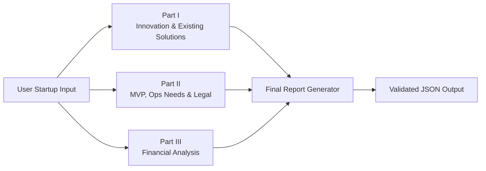
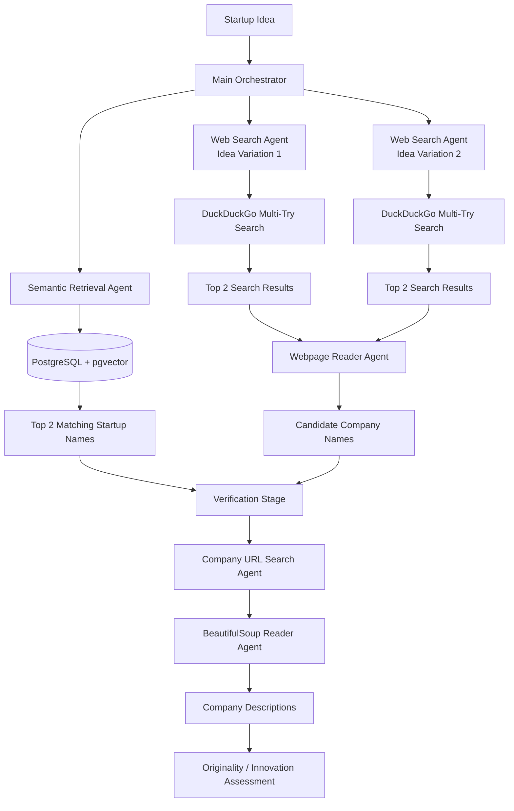
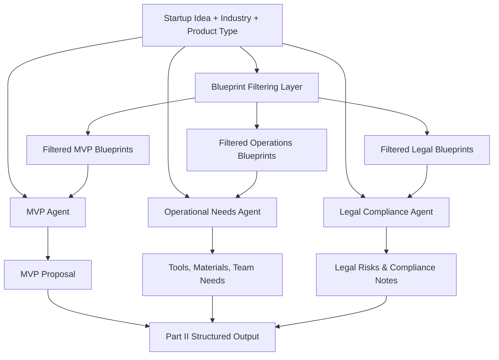
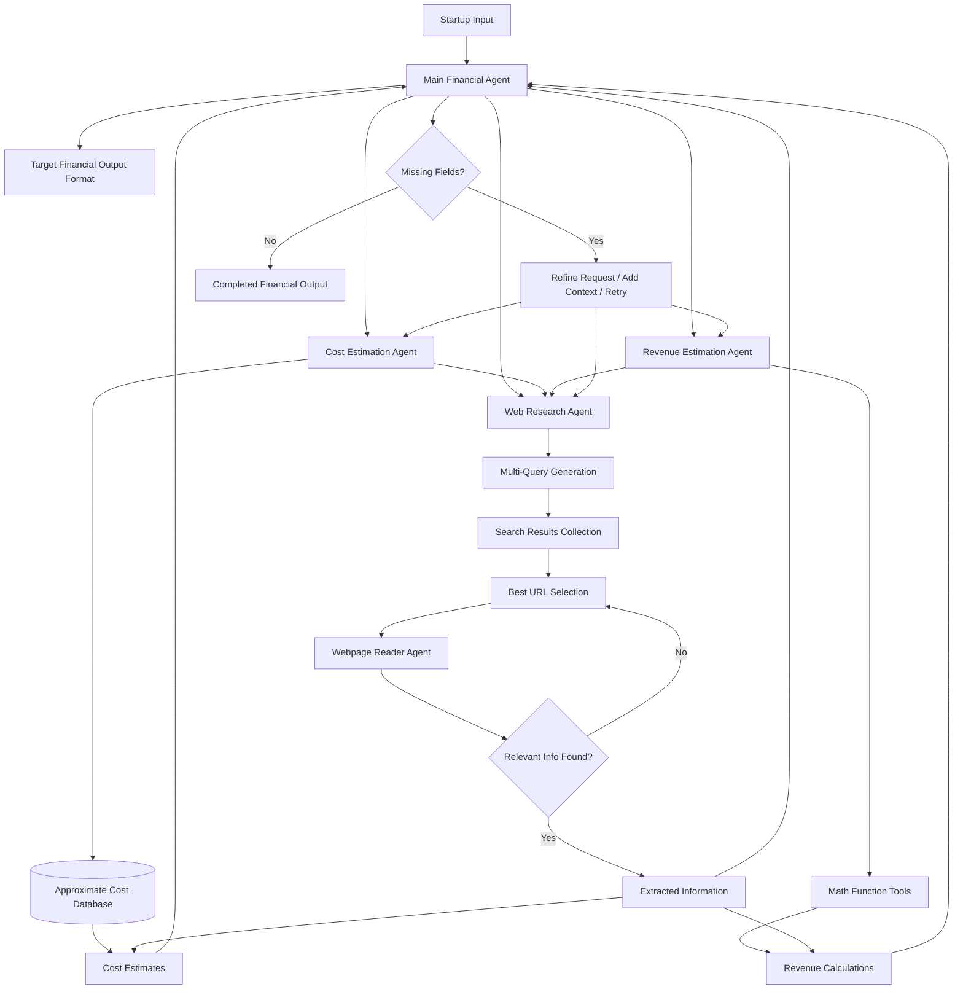

# Startup Idea Validation Multi-Agent System

## Overview

This project is presented as an academic work whose purpose is to demonstrate practical control over **agentic AI systems**, **multi-agent collaboration**, and **MCP / A2A-style workflows**.

Its objective is to help people who are thinking about launching a startup gain a clearer vision of their idea by evaluating it across three main dimensions:

1. **Innovation and existing solutions**
2. **Operational feasibility and MVP design**
3. **Financial viability**

Rather than acting as a perfectly accurate decision-maker, the system is designed as a **guided approximation tool**. Its purpose is to accelerate research, structure uncertainty, and provide a user with a first serious overview of what their startup idea may involve.

---

## Global Pipeline

The system is organized into four stages:

1. **Innovation and existing solutions analysis**
2. **MVP design, operational needs, and legal compliance**
3. **Financial analysis and projection**
4. **Final JSON report generation and validation**

### Global Architecture



---

# Part I — Innovation and Existing Solutions

The first part of the system evaluates whether a startup idea is innovative and whether similar solutions already exist.

Its role is to identify companies that may already be addressing the same problem, understand what they actually do, and determine whether the proposed idea appears original, partially differentiated, or already covered by existing solutions.

## Main Logic

This part is built around a **main orchestrator agent** that coordinates several specialized agents.

First, the startup idea is sent to a **semantic retrieval agent**. This agent performs a similarity search over a **PostgreSQL database enhanced with pgvector**. The database contains around **1000 startups in Tunisia**, together with descriptions scraped from the web. Its role is to return the **two most semantically relevant company names** related to the startup idea.

In parallel, the orchestrator launches a **web-search branch**. The same startup idea is expressed in **two different formulations** in order to improve retrieval quality. This design choice was introduced because relevant web results can vary significantly depending on the phrasing of the idea. Using two variations increases coverage and helps surface competitors that may be missed by a single formulation.

The web-search branch uses **DuckDuckGo**. However, DuckDuckGo was found to be highly inconsistent: identical or nearly identical queries could return different results across runs. To reduce this issue, a **multi-try strategy** was introduced. Instead of relying on a single search, the same request is executed multiple times, and the **top two most relevant results** are retained.

The URLs returned by this search process are then passed to a **webpage reader agent**, whose role is to read the pages and extract only the **names of companies** that seem to match the startup idea.

Once candidate company names have been collected from both the semantic branch and the web branch, the system enters a **verification stage**.

In this stage, a first agent searches for the most relevant URLs associated with each company name, again using the same DuckDuckGo multi-try strategy. A second agent then reads the selected webpages using **BeautifulSoup** in order to extract a short description of what each company actually does.

Finally, the orchestrator compares all gathered evidence and produces a judgment on whether the startup idea is original, innovative, or already represented by existing solutions.

## Architecture Summary

- Main orchestrator agent
- Semantic retrieval agent using PostgreSQL + pgvector
- Local database of ~1000 Tunisian startups with web-scraped descriptions
- Web search branch using **two different idea formulations**
- Multi-try DuckDuckGo search to reduce result inconsistency
- Webpage reader agent for extracting candidate company names
- Verification stage with URL search + webpage reading
- Final originality and innovation assessment

## Architecture Diagram



---

# Part II — MVP Design, Operational Needs, and Legal Compliance

The second part of the system focuses on transforming the startup idea into a more concrete and actionable structure.

Its objective is to define:

- a first **MVP**
- the main **operational needs**
- the most relevant **legal and compliance considerations**

## Main Logic

This stage is built around **three specialized agents**:

- an **MVP agent**
- an **operational needs agent**
- a **legal compliance agent**

Each agent relies on its own **JSON knowledge base** made of structured blueprints.

The system first extracts key startup descriptors from the user input, especially the **industry** and the **product type**. These attributes are then used to filter the blueprint collections so that each agent only receives the most relevant templates.

Three knowledge bases are used:

1. **MVP blueprints**
2. **Operational needs blueprints**
3. **Legal and compliance blueprints**

The MVP knowledge base contains templates describing what an initial version of a product may look like depending on the sector and product category.

The operational needs knowledge base contains templates related to:

- tools
- materials
- resources
- team members
- important operational roles

The legal knowledge base contains templates related to:

- compliance requirements
- legal obligations
- sector-specific risks
- regulatory concerns

After filtering, each agent receives the startup idea together with the subset of blueprints that best matches the selected **industry** and **product type**. Each agent then tries to align the startup concept with the blueprint structure it has been given.

This makes the second part less dependent on free generation and more grounded in structured prior knowledge.

## Agent Roles

### MVP Agent

The MVP agent proposes what the first realistic version of the startup’s product should look like.

Its objective is to identify the minimum core features and essential components required to launch an initial usable product.

### Operational Needs Agent

The operational needs agent estimates what is required to move from concept to implementation.

This includes:

- tools
- materials
- operational resources
- team composition
- key roles

### Legal Compliance Agent

The legal compliance agent identifies important legal and regulatory points linked to the startup’s activity.

Its role is not to replace a legal expert, but to provide an early warning layer and make the user aware of important compliance questions from the beginning.

## Architecture Summary

- Input uses startup idea + industry + product type
- Three JSON knowledge bases
- One agent per domain: MVP, operations, legal
- Blueprint filtering based on industry and product type
- Each agent matches the startup idea against relevant structured templates
- Final output combines product design, needs, and compliance awareness

## Architecture Diagram



---

# Part III — Financial Analysis and Projection

The third part of the system is the most agentic component of the architecture.

Its goal is to build a structured financial analysis by progressively filling a predefined output format.

## Main Logic

At the center of this stage is a **main financial agent**.

This agent is not a passive task dispatcher. It actively reasons over the expected output, checks what information is missing, reformulates requests, retries with better input, and directly uses web research when needed. Its role is to keep working until the target financial structure is sufficiently completed.

The main financial agent has access to:

- a **cost estimation agent**
- a **revenue estimation agent**
- a **web research agent**

The main agent sends requests to worker agents, evaluates their responses, detects missing fields, and adapts its strategy until the output format is filled.

If a worker agent reports missing information, the main agent tries to provide that missing context itself. If a response is weak or incomplete, it retries using refined instructions. If the worker agents do not provide enough useful information, the main agent can perform web research on its own.

This is what makes this module the most agentic one: the intelligence lies in the **reasoning behavior of the main financial agent**, not in a simple fixed pipeline.

## Cost Estimation Agent

The cost estimation agent estimates startup expenses.

It has access to a database of approximate costs, including examples such as **salary approximations in Tunisia by job category**. It can also call the web research agent when the local data is not enough.

Its outputs may include estimates related to:

- salaries
- infrastructure
- tools
- operations
- other major startup costs

## Revenue Estimation Agent

The revenue estimation agent estimates potential revenue.

It has access to **math-function tools** for calculations and projections, and it can also use web research when it needs supporting market information.

Its role is to generate revenue scenarios based on assumptions, calculations, and available evidence.

## Web Research Agent

The web research agent itself follows a multi-step internal process.

When asked to find information, it does not rely on a single query. Instead, it:

1. generates **multiple search queries**
2. collects results from these queries
3. selects the best candidate URLs
4. sends them to a **webpage reader agent**
5. retries with another URL if the needed information is not found

This makes research more robust than a simple one-shot search.

## Agentic Reasoning Behavior

The main financial agent continuously tries to complete the expected structure by:

- checking which fields are still missing
- asking worker agents for specific information
- refining requests when answers are incomplete
- adding missing context when workers need more input
- retrying when results are not sufficient
- using web search on its own when necessary

## Architecture Summary

- One main financial agent responsible for filling the final financial structure
- One cost estimation agent
- One revenue estimation agent
- One web research agent
- Cost agent uses a local approximation database + web research
- Revenue agent uses math tools + web research
- Main agent retries, reformulates, and fills missing information dynamically
- Web research uses multi-query generation, webpage reading, and retry logic

## Architecture Diagram



---

# Final Aggregation and Report Generation

After the three main parts have produced their outputs, the whole result is passed to a **large language model** responsible for generating the final report in **JSON format**.

This model has access to the outputs of all previous stages, which gives it a broader view of the complete startup analysis.

Its **main role** is to prepare a clean JSON object that can be directly consumed by the web application.

Because it sees the full picture, it also acts as a **validation layer**. It can detect inconsistencies, mention contradictions, and point out missing elements across sections. However, its primary function is still **final report preparation**, not deep re-analysis.

## Final Role of the Large Language Model

- Collect outputs from Part I, Part II, and Part III
- Organize the full result into a structured JSON format
- Detect inconsistencies across sections
- Highlight missing or contradictory information
- Produce a final web-ready JSON report

---

# Challenges and Limitations

Building this system involved several practical difficulties, most of them linked to **small local language models** and **unstable web retrieval**.

## Working with a Small Language Model

One of the first major difficulties was model choice.

The project initially started with **Qwen 2.5 7B**, but obtaining stable and useful outputs was difficult. After repeated limitations, the system was migrated to **Qwen3 8B**, which improved the quality of the results significantly.

Even with that improvement, the project still relied on a relatively small model. This introduced two main constraints:

- limited reasoning robustness compared to larger models
- limited context-window capacity

Because of these constraints, a large amount of **prompt engineering** was required, and the overall workflow had to be divided into multiple agents and multiple parts. This decomposition was therefore both an architectural choice and a practical workaround.

## Transition from Script-Based Agents to MCP / A2A Protocols

Another challenge appeared when moving from a simpler implementation to a protocol-based architecture.

At first, the different parts were built mainly as direct scripts using **LangGraph** and **LangChain**, and the system could already produce fairly good results.

Later, when the architecture was migrated to **MCP** and **A2A**, the quality dropped somewhat. The main reason was that these protocols introduce extra metadata such as:

- role descriptions
- agent cards
- communication formatting

While useful from a systems perspective, this extra metadata was not very helpful for a **small local LLM with limited context**. Some of the model’s capacity was being consumed by protocol-related structure instead of the core reasoning task.

To reduce this issue, adjustments were made so that agents would receive information as close as possible to what they had received before the MCP / A2A transition. Even so, protocol overhead remained a real limitation.

## DuckDuckGo Search Inconsistency

The biggest practical issue in the project was the instability of **DuckDuckGo search results**.

For the same query, DuckDuckGo could return significantly different results across runs. This meant that even when the rest of the pipeline remained unchanged, two executions could still produce different outputs.

To reduce this effect, a **multi-try strategy** was introduced. Instead of relying on a single search run, the same search was executed multiple times and only the top two results were kept.

This improved robustness, but did not fully solve the issue. DuckDuckGo still does not guarantee that the webpage actually needed will appear within the early retrieved results.

## Context-Window Constraints in Web Processing

This problem became even harder because the agents were operating under small context-window limits.

Even when many potentially useful pages were available, the system could not process an unlimited number of webpages. This created a tradeoff between:

- broader search coverage
- practical reading limits for the model

As a result, some relevant sources may still be missed.

## Summary of Main Difficulties

The main challenges can be summarized as follows:

- limits of small local language models
- heavy prompt engineering requirements
- need to decompose the system into several agents and parts
- quality loss after moving from direct scripts to MCP / A2A
- protocol metadata consuming valuable context space
- high inconsistency in DuckDuckGo search
- inability to process too many webpages because of context limits

These constraints strongly shaped the final design of the project.

---

# Project Architecture and Execution

## Architecture Overview

The system runs as a multi-agent pipeline supported by both **MCP** and **A2A** communication servers.

The main execution flow relies on the following core scripts:

- `exist_sol_ag.py`
- `final_startup_report_pipeline.py`
- `manager_ag.py`
- `final_reporter.py`

These scripts are launched according to the startup input stored in `user_input.json`.

The project can be used in three ways:

1. by running the full pipeline automatically
2. by launching the scripts individually
3. by using the Streamlit web interface

## How to Run the Project

First, create and activate a virtual environment, then install the dependencies from `requirements.txt`.

```bash
python -m venv .venv
source .venv/bin/activate
pip install -r requirements.txt
```

Then start the two servers in **two separate terminals**:

```bash
python mcp_server.py
```

```bash
python a2a_server.py
```

Once both servers are running, launch the full pipeline:

```bash
python run_pipeline.py
```

## Input Configuration

The main input file is:

```text
user_input.json
```

You can modify this file freely depending on the startup idea, industry, product type, or any other configuration you want to test.

## Alternative Execution Modes

You can also run the main scripts individually for testing or debugging purposes:

- `exist_sol_ag.py`
- `final_startup_report_pipeline.py`
- `manager_ag.py`
- `final_reporter.py`

All generated outputs are saved in the `outputs/` folder, and the detailed activity of the agents can be observed directly in the terminal.

## Streamlit Dashboard

The project can also be launched through a Streamlit interface:

```bash
streamlit run app.py
```

This provides a cleaner dashboard where the user can enter startup inputs, launch the pipeline, and inspect the final result more comfortably.

## Execution Time

A full run of the complete process takes approximately **8 minutes**, and may sometimes reach **10 minutes** when agents need extra retries to gather enough information.

---

# Results and Evaluation

The overall quality of the system’s results can be estimated at around **7.5/10** on average.

In practice:

- some runs may produce results closer to **7/10**
- stronger runs may reach **8/10** or even **8.5/10**

It is important to note that this system was **not designed to be a perfectly accurate decision-maker**. Its purpose is to act as an **approximation and guidance tool** rather than a final source of truth.

For this reason, the pipeline was designed to explicitly mention when information is:

- uncertain
- inconsistent
- incomplete

This helps reduce the risk of presenting weak information as if it were fully reliable.

Even with these limitations, the system remains useful. Its main value is that it allows a user to obtain, in less than ten minutes, a large amount of information that might otherwise require hours of manual web research.

Its weaknesses are also similar to those a human would face during manual research. Finding reliable information on the web is difficult in general, and especially difficult in the Tunisian context, where structured and accessible information is often limited.

As a result, the system is especially useful as:

- a time-saving tool
- an early approximation system
- a structured reflection assistant
- an awareness tool for startup planning

It may be particularly helpful for:

- younger users
- first-time founders
- people who are not yet familiar with business planning
- users with limited knowledge of MVP design, operational planning, finance, or legal issues

Even when the output is not perfectly precise, it still gives the user a much clearer global view of the idea and highlights the main aspects that need to be considered before moving forward.

---

# Script and Folder Reference

This section gives a practical map of the main scripts and folders in the repository. Some files are part of the final execution flow, while others are helper scripts or standalone testing scripts that were used during development.

## Main Execution Files

- `run_pipeline.py` is the script used to run the main pipeline scripts in the correct order. It also prints command-line progress information and includes a timer to show how long the full execution takes.
- `user_input.json` contains an example user input. It is useful for testing the pipeline when running the scripts manually or independently.
- `app.py` is a simple Streamlit application used to test the system through a web interface instead of only using the terminal.
- `requirements.txt` contains the Python dependencies used in the environment. It was generated as a simple `pip freeze` file.

## MCP and A2A Communication Layer

- `mcp_server.py` starts the MCP server. It should be run in a separate terminal when using the protocol-based version of the system.
- `a2a_server.py` starts the A2A server. It should also be run in a separate terminal, alongside the MCP server.
- `mcp_tool_wrappers.py` provides the wrapper layer that receives tool calls from agents and adapts them so they can work through the MCP protocol.
- `a2a_tool_wrappers.py` provides the wrapper layer that receives tool calls from agents and adapts them so they can work through the A2A protocol.
- `shared/` contains shared configuration files and clients used by the MCP and A2A communication layers.

## Part I - Existing Solutions and Innovation Analysis

- `exist_sol_ag.py` is the main agent of the first part. It orchestrates the existing-solutions search by looking for similar companies both in the local database and on the web. For each company name found, it searches for more information and produces a final judgment about whether the startup idea is innovative or whether similar solutions already exist.
- `tools.py` and `tools1.py` contain the tool definitions used mainly by the first part of the system. Because the local model is relatively small but efficient at using tools, many agent actions are wrapped as tool calls. This makes it possible to keep using the agents inside A2A and MCP-style communication while improving the stability of the results.
- `search_web_results_ag.py` is an agent that searches for relevant URLs using a description of the startup idea. It chooses the best matching results, uses `extract_company_names_from_url` to extract company names, and then uses `describe_company_from_url` to verify them. Its final goal is to return the best matching company names.
- `search_company_ag.py` is an agent used during the existing-solutions analysis. Given a company name, it searches the web for relevant URLs, uses `get_company_description_from_url` to read and understand the results, and returns the most likely matching company description.
- `company_name_extractor_ag.py` is an agent that receives webpage content and the startup description, then extracts company names that appear to match the startup idea. This is useful because many webpages are either company pages or list pages containing several company names.
- `company_description_short_ag.py` is a helper agent that reads a company webpage and returns a short description of what the company does.
- `company_description_clear_ag.py` is a helper agent that reads a company webpage and returns a clearer, more detailed factual description of what the company does.

## Part II - MVP, Operational Needs, and Legal Signals

- `final_startup_report_pipeline.py` integrates the three agents of the second part so they can run together and produce the MVP, operational needs, and legal/compliance outputs.
- `mvp_builder_agent_test.py` is a standalone testing script for the MVP builder agent. It was used to test the MVP results before integration into the full second-part pipeline.
- `ops_needs_agent_test.py` is a standalone testing script for the operational needs agent. It was used to test the tools, materials, resources, and team needs output before integration.
- `legal_signals_agent_test.py` is a standalone testing script for the legal signals agent. It was used to test the legal and compliance output before integration.
- `knowledge/` contains the blueprint knowledge bases used by the second-part agents. These blueprints support the MVP, operational needs, and legal/compliance agents.
- `mvp_needs/` contains additional testing scripts related to the MVP and needs part of the project.

## Part III - Financial Analysis

- `manager_ag.py` is the main agent of the financial part. It coordinates the cost agent, revenue agent, and web research agent through natural-language tasks and context. It manages missing information, errors, and retries, with the final goal of filling a structured financial output format.
- `cost_ag.py` is one of the main financial agents. It receives a task and context, then estimates how much different parts of the startup may cost. It has access to a local knowledge base with general cost information and can ask a web research agent for additional information when needed.
- `revenue_ag.py` is one of the main financial agents. It receives a task and supporting information, uses math tools to perform calculations, and can ask a web research agent to search for additional market or pricing information.
- `research_ag.py` is a web research agent that works from tasks. It generates multiple search queries, sends webpage results to a reader agent, retries with different queries or pages when needed, and returns the information requested by the task.
- `webpage_reader_ag.py` is an agent used in the financial analysis part. Its job is to read the content of a webpage and return the specific information requested from it.
- `finance_knowledge/` contains the financial knowledge base used especially by the cost agent. It stores general cost references and approximate information used during financial estimation.

## Final Report Generation

- `final_reporter.py` is the final reporting agent. It uses a larger language model with a bigger context window. It receives the initial user input and the outputs of the previous agents, then generates the final report in JSON format for use in the web application. It also checks for uncertain, inconsistent, or untrustworthy information and signals it in the output.

## Outputs and Intermediate Data

- `outputs/` is the folder where generated results are saved when the full pipeline runs. The scripts use this folder to store outputs and, in some cases, communicate results between different stages of the system.
- `ops_output.json` is an output file related to the operational-needs part of the system. It is not a main pipeline script, but it can be useful for inspecting or testing intermediate results.

## Other Folders

The repository also contains additional folders such as `examples/`, `exist_sol_two_server_a2a_mcp/`, and `finance_two_server_a2a_mcp/`. These are not required to understand the main final pipeline described in this README and can be ignored for the main explanation.

